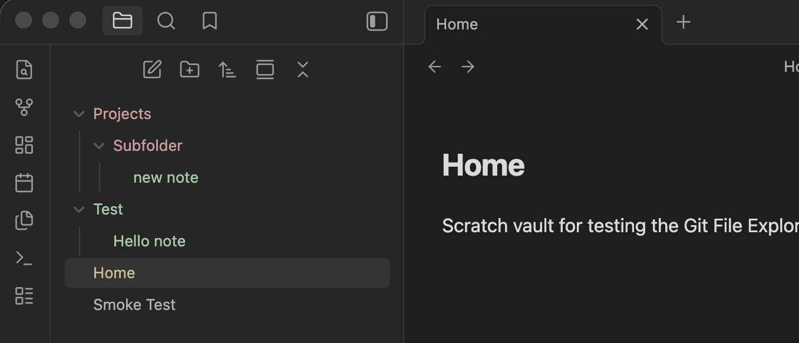

# Obsidian Git File Explorer Colors

Obsidian plugin for AI second-brain users that colors the File Explorer by Git status, helping you spot markdown changes instantly without turning Obsidian into a full IDE.

Git File Explorer Colors is a desktop-only, read-only Obsidian plugin for vaults that live inside a single Git repository. It colors file rows directly from Git status and rolls changed descendants up to folders using `deleted > modified > new` priority.



## What It Does

- Colors new or untracked files in green
- Colors modified files in muted orange
- Colors deleted paths as a folder signal in muted red
- Adds Zed-style editor gutter markers for added, modified, and deleted lines in tracked files
- Rolls descendant changes up to parent folders
- Refreshes on vault create, modify, rename, and delete events
- Includes a fallback polling refresh for external Git changes
- Adds a manual `Refresh colors` command for recovery

## Requirements

- Obsidian desktop
- `git` installed and available on your system path
- A vault that is itself a Git repository, or a vault contained inside one single Git repository
- Local filesystem access through Obsidian's desktop app

This plugin does not stage, commit, or modify Git state. It only reads status and colors the File Explorer.

## Status Mapping

- `new`: untracked files and newly added files
- `modified`: tracked files with content or metadata changes
- `deleted`: deleted files, primarily shown through parent-folder rollups when the file row is no longer visible

Folder priority is `deleted > modified > new`.

## Installation

### Community Plugins

Once the plugin is approved in the Obsidian Community Plugins directory:

1. Open `Settings -> Community plugins`
2. If `Restricted mode` is still enabled for this vault, turn it off
3. Browse for `Git File Explorer Colors`
4. Install and enable it

### Manual Install

Until it is published, or if you want to install a specific build:

1. Download `manifest.json`, `main.js`, and `styles.css` from a GitHub release
2. Create this folder in your vault:
   `.obsidian/plugins/git-file-explorer-colors/`
3. Copy the three files into that folder
4. Reload Obsidian and enable `Git File Explorer Colors`

## Usage

The plugin reads Git status from the current vault root, normalizes it to `new`, `modified`, and `deleted`, and applies those states to the File Explorer.

- Files are colored from their direct Git status
- Folders are colored from descendant changes
- Deleted files typically show up as red parent folders, because the deleted file row itself no longer exists in the tree
- In the editor gutter, tracked added lines show green, modified lines show orange, and deleted lines show a red triangle at the deletion point
- External Git changes are picked up by the fallback timer or the `Refresh colors` command

## Troubleshooting

If the plugin installs but no colors appear:

1. Run `Refresh colors` from the command palette and read the notice text.
2. Confirm the vault is inside a Git repository.
3. Confirm `git --version` works in your system terminal.
4. Fully quit and reopen Obsidian after installing Git.

On macOS:

- If the notice says the Xcode license must be accepted, run `sudo xcodebuild -license accept` in Terminal.
- If the notice says Command Line Tools are missing, run `xcode-select --install`.

On Windows:

- Confirm `git --version` works in Command Prompt or PowerShell, not only in Git Bash.
- If you just installed Git, fully quit and reopen Obsidian so it can pick up the updated `PATH`.

On Linux:

- Confirm Git is installed and `git --version` works in your terminal.
- If Obsidian was installed through a sandboxed package such as Flatpak, access to the host `git` executable may require extra setup.

## Settings

- `Color file rows`
- `Color folder rows`
- `Show editor gutter markers`
- `New color`
- `Modified color`
- `Deleted color`
- `Refresh interval`

The default palette is intentionally muted so the explorer stays readable during normal note-taking. The `New color`, `Modified color`, and `Deleted color` settings are shared across both the File Explorer and the editor gutter markers.

## Limitations

- Desktop only
- Single-repo scope for v1
- Read-only Git integration
- No staging or committing UI
- No diff viewer
- No mobile support
- No multi-repo support inside one vault

## Development

```bash
npm install
npm run dev
```

Useful scripts:

- `npm run build` builds a production release
- `npm run check` runs the TypeScript check
- `npm run test` runs the unit test suite
- `npm run validate` runs `check`, `test`, and `build`
- `npm run sync:scratch` copies the built plugin into the local scratch vault in `tmp/scratch-vault`

## Release

For a Community Plugin release:

1. Bump `manifest.json`, `package.json`, and `versions.json` as needed
2. Run `npm run validate`
3. Create a GitHub release whose tag exactly matches `manifest.json` `version`
4. Upload `manifest.json`, `main.js`, and `styles.css` as release assets
5. Submit the plugin to `obsidianmd/obsidian-releases`

The release should upload `manifest.json`, `main.js`, and `styles.css` as GitHub release assets for Obsidian Community Plugin submission.
